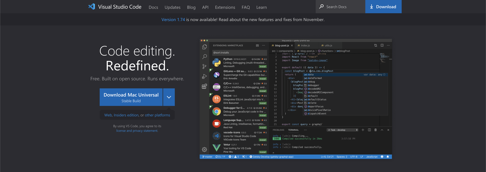
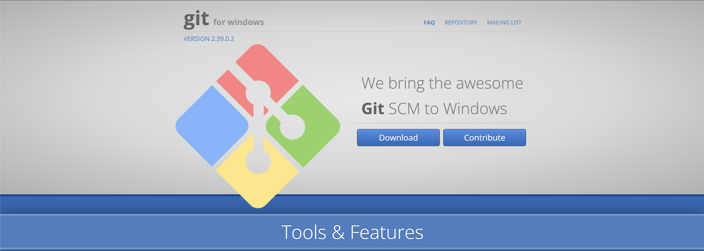
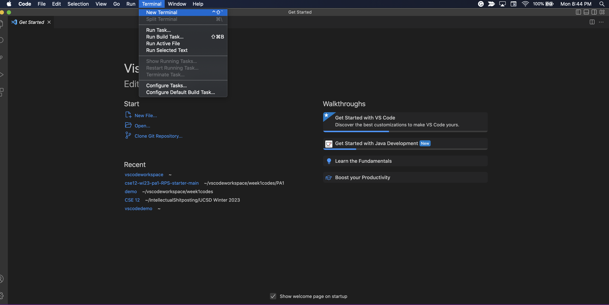
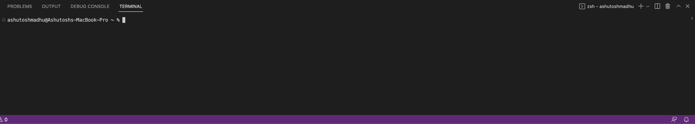
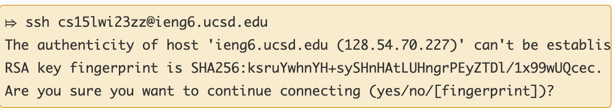
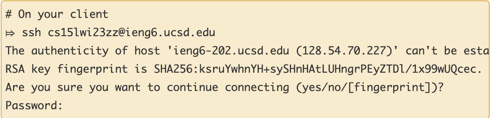
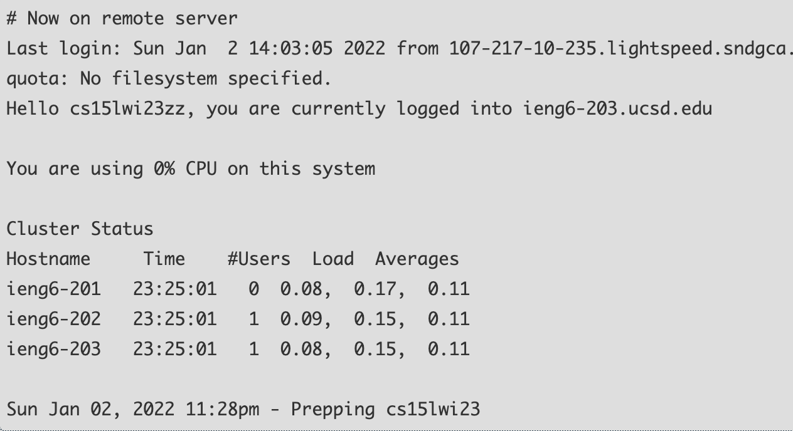

**Installing Visual Studio Code**
1. Download [vscode](https://code.visualstudio.com/). 
	
Follow the directions on the webpage and install the appropriate version for your device preferably the latest.   
Make sure to install [git](https://gitforwindows.org/) for windows.  

If using Mac git is already installed through a binary package from Xcode. 

2. After installing open the file and follow the directions.

**Remotely Connecting**
1. Open Visual Studio Code and open the menu bar. Click on Terminal and select New terminal or use the following command indicated by the option.  
  
The terminal should look like this.

2. To login to your cse15l account type the command `ssh cs15lwi23zz@ieng6.ucsd.edu` and replace the zz with the last 3 letters of your cse15l user account. You will be prompted to enter your password for your account. After entering your message should look like this if its your first time connecting to the server.

3. After logging in you should get a message saying that you are "Now remote on the server."
. 
**Running Commands**. 
Try to run these commands on the terminal in your Vscode shell or on your computer.  
*`cd ~`*
*`cd`*
*`ls -lat`*
*`ls -a`*
*`ls <directory> where <directory> is /home/linux/ieng6/cs15lwi23/cs15lwi23abc`, where the abc is one of the other group members’ username*
*`cp /home/linux/ieng6/cs15lwi23/public/hello.txt ~/`*
*`cat /home/linux/ieng6/cs15lwi23/public/hello.txt`*

