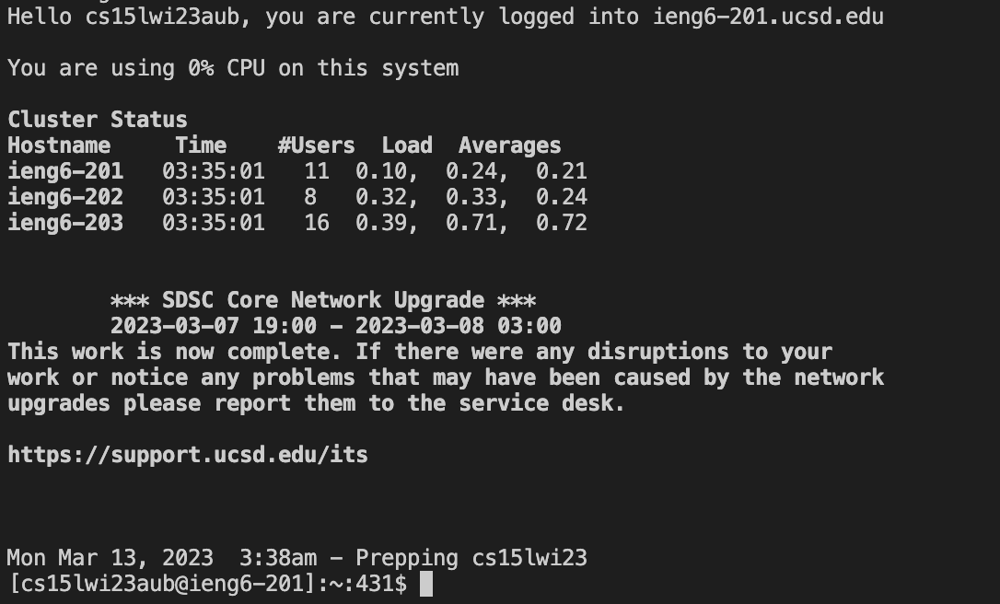

#Lab 4
. 
Logged in ieng6. 
```<ctrl>``` + ```<r>``` type ssh bash command was ssh cs15lwi23aub@ieng6.ucsd.edu. 
. 
```<ctrl>``` + ```<r>```  then type <git><space><clone>.
<ls><space><-l>. 
. 
<ctrl>+<r> + type <javac>. 
.
<ctrl> <r> type <cd><space> <enter>
```<ctrl>``` + ```<r>``` + type <java><space><-><enter> to run the ListExamplesTests file. 

type the command <ctrl> <r> <vi> <space><L><enter>
. 

use up arrow  6 times <up> times then type <b><b><left><r><2>. 
. 
type <:><wq><enter>
```<ctrl>``` + ```<r>```  then type <javac> to compile
```<ctrl>``` + ```<r>``` then ype <java> to run
. 
```<ctrl>``` + ```<r>``` + type <git><space><a><enter> to commit add
```<ctrl>``` + ```<r>```+ type <git><commit><space><-m> to commit  
```<ctrl>``` + ```<r>``` + type <git><space><p><enter> to push file to repository
. 


  
 


