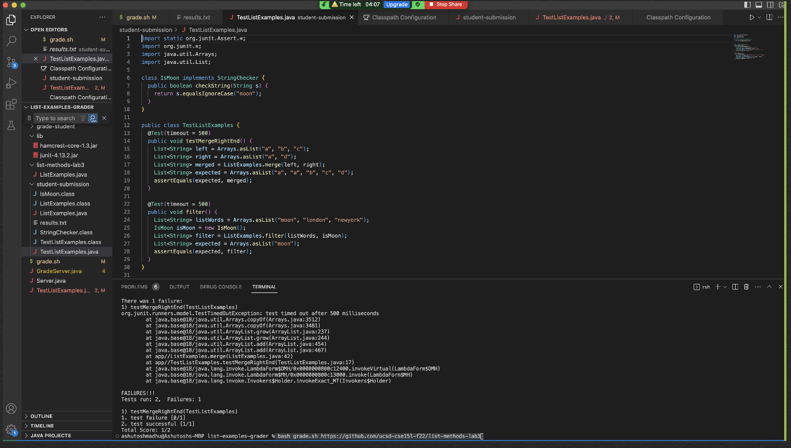
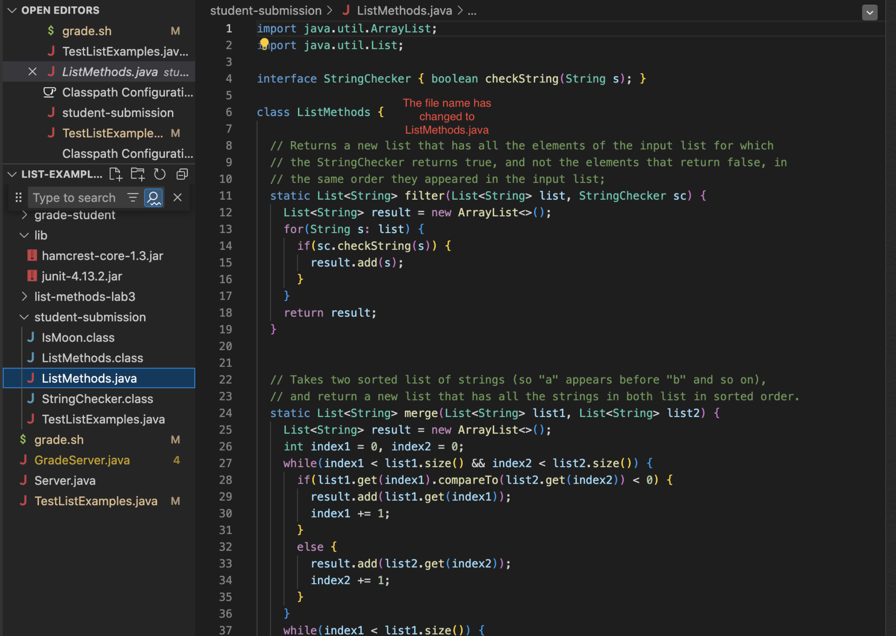
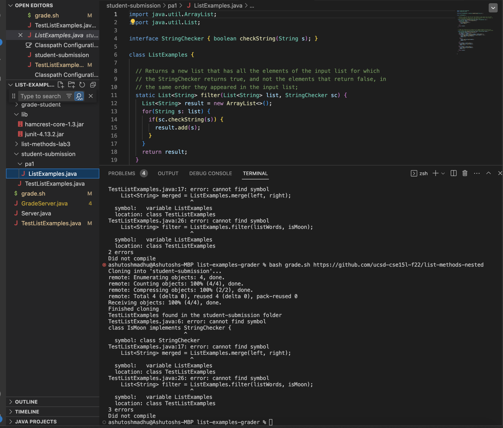
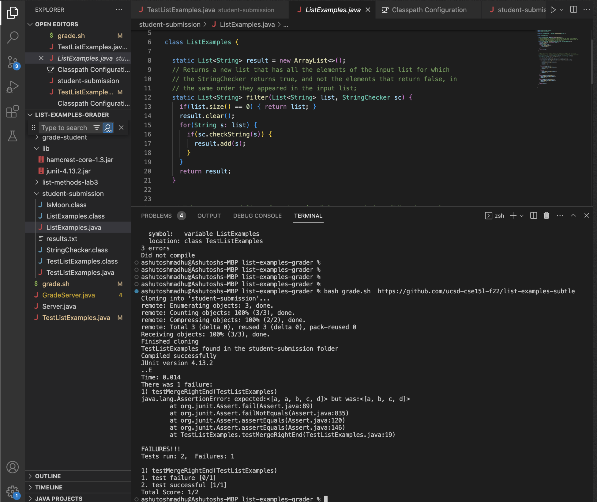
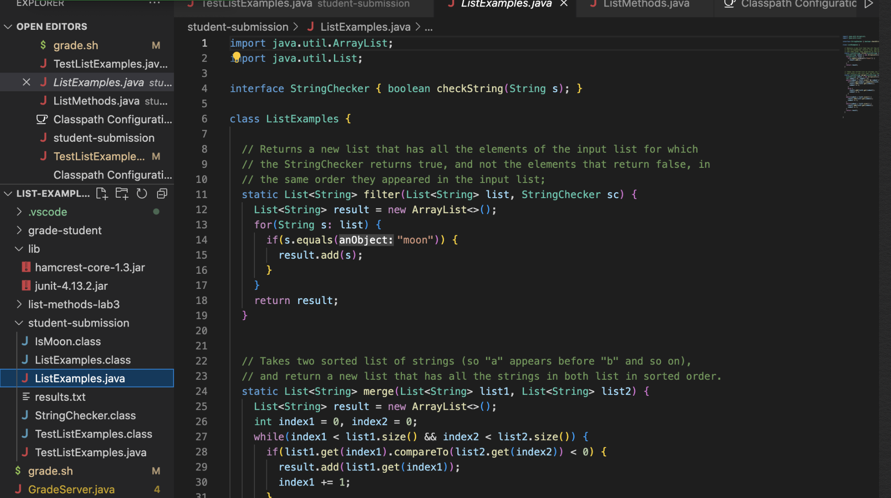

#Lab 6#  
**This is my grade.sh file!** 
```
CPATH='.:../lib/hamcrest-core-1.3.jar:../lib/junit-4.13.2.jar'
CTEST='.:../lib/hamcrest-core-1.3.jar:../lib/junit-4.13.2.jar org.junit.runner.JUnitCore'
FILE='TestListExamples.java'

totalTests=2
score=2


rm -rf student-submission
git clone $1 student-submission
echo 'Finished cloning'
cp TestListExamples.java student-submission
#cp $CPATH student-submission
#cp $CTEST student-submission

if [[ -f $FILE ]]
then
    echo "TestListExamples found in the student-submission folder"
else
    exit 1
fi

cd student-submission

javac -cp $CPATH *.java
# echo $?
if [[ $? -eq 0 ]] #checks to see if the last command in the shell ran successfully
then 
    echo "Compiled successfully"
else
    echo "Did not compile"
    exit 1
fi

java -cp $CTEST TestListExamples > results.txt
cat results.txt

grep "testMergeRightEnd(TestListExamples)" results.txt 
if [ $? -eq 0 ]; then
    echo "1. test failure [0/1]"
    score=$((score-1))
else
    echo "1. test successful [1/1]"
fi

grep "filter(TestListExamples)" results.txt 
if [ $? -eq 0 ]; then
    echo "2. test failure [0/1]"
    score=$((score-1))
else
    echo "2. test successful [1/1]"
fi

echo "Total Score:" $score/2
```  
***CASE 1***  
type the command ```bash grade.sh https://github.com/ucsd-cse15l-f22/list-methods-lab3```  
Output:  
Cloning into 'student-submission'...  
remote: Enumerating objects: 3, done.  
remote: Counting objects: 100% (3/3), done.  
remote: Compressing objects: 100% (2/2), done.  
remote: Total 3 (delta 0), reused 3 (delta 0), pack-reused 0. 
Receiving objects: 100% (3/3), done.   
Finished cloning. 
TestListExamples found in the student-submission folder. 
Compiled successfully.  
JUnit version 4.13.2.  
..E.  
Time: 0.586 
There was 1 failure:
1) testMergeRightEnd(TestListExamples)
org.junit.runners.model.TestTimedOutException: test timed out after 500 milliseconds
        at java.base@18/java.util.Arrays.copyOf(Arrays.java:3512)
        at java.base@18/java.util.Arrays.copyOf(Arrays.java:3481)
        at java.base@18/java.util.ArrayList.grow(ArrayList.java:237)
        at java.base@18/java.util.ArrayList.grow(ArrayList.java:244)
        at java.base@18/java.util.ArrayList.add(ArrayList.java:454)
        at java.base@18/java.util.ArrayList.add(ArrayList.java:467)
        at app//ListExamples.merge(ListExamples.java:42)
        at app//TestListExamples.testMergeRightEnd(TestListExamples.java:17)
        at java.base@18/java.lang.invoke.LambdaForm$DMH/0x0000000800c12400.invokeVirtual(LambdaForm$DMH)
        at java.base@18/java.lang.invoke.LambdaForm$MH/0x0000000800c13000.invoke(LambdaForm$MH)
        at java.base@18/java.lang.invoke.Invokers$Holder.invokeExact_MT(Invokers$Holder)

FAILURES!!!
Tests run: 2,  Failures: 1

1) testMergeRightEnd(TestListExamples)
1. test failure [0/1]
2. test successful [1/1]
Total Score: 1/2. 

NOTE: This TESTLISTEXAMPLES.java  is copied to the student-submission directory


***CASE 2***.= 
type the command ```bash grade.sh https://github.com/ucsd-cse15l-f22/list-methods-corrected.```  
Cloning into 'student-submission'...  
remote: Enumerating objects: 3, done.    
remote: Counting objects: 100% (3/3), done.      
remote: Compressing objects: 100% (2/2), done.       
remote: Total 3 (delta 0), reused 3 (delta 0), pack-reused 0.     
Receiving objects: 100% (3/3), done.      
Finished cloning     
TestListExamples found in the student-submission folder 
Compiled successfully 
JUnit version 4.13.2 
.. 
Time: 0.011 
 
OK (2 tests)  

1. test successful [1/1] 
2. test successful [1/1] 
Total Score: 2/2 

NOTE: This is a perfect case where all tests passed. 


***CASE 3*** 
type the command ```bash grade.sh https://github.com/ucsd-cse15l-f22/list-methods-compile-error```      
Cloning into 'student-submission'...    
remote: Enumerating objects: 3, done.    
remote: Counting objects: 100% (3/3), done.    
remote: Compressing objects: 100% (2/2), done.    
remote: Total 3 (delta 0), reused 3 (delta 0), pack-reused 0   
Receiving objects: 100% (3/3), done.    
Finished cloning   
TestListExamples found in the student-submission folder     
ListExamples.java:15: error: ';' expected    
        result.add(0, s)     
                        ^ 
1 error   
Note: Did not compile   

***CASE 4***     
type the command ```bash grade.sh https://github.com/ucsd-cse15l-f22/list-methods-signature```    
Cloning into 'student-submission'...   
remote: Enumerating objects: 3, done.  
remote: Total 3 (delta 0), reused 0 (delta 0), pack-reused 3  
Receiving objects: 100% (3/3), done.  
Finished cloning  
TestListExamples found in the student-submission folder  
TestListExamples.java:26: error: incompatible types: List<String> cannot be converted to StringChecker  
    List<String> filter = ListExamples.filter(listWords, isMoon);  
                                              ^
Note: Some messages have been simplified; recompile with -Xdiags:verbose to get full output  
1 error  
Did not compile  

***CASE 5***  

type the command ```bash grade.sh https://github.com/ucsd-cse15l-f22/list-methods-filename```     
Output:      
Cloning into 'student-submission'...      
remote: Enumerating objects: 3, done.      
remote: Counting objects: 100% (3/3), done.       
remote: Compressing objects: 100% (2/2), done.      
remote: Total 3 (delta 0), reused 3 (delta 0), pack-reused 0     
Receiving objects: 100% (3/3), done.    
Finished cloning    
TestListExamples found in the student-submission folder     
TestListExamples.java:17: error: cannot find symbol     
    List<String> merged = ListExamples.merge(left, right);     
                          ^ 
  symbol:   variable ListExamples    
  location: class TestListExamples    
TestListExamples.java:26: error: cannot find symbol    
    List<String> filter = ListExamples.filter(listWords, isMoon);    
                          ^ 
  symbol:   variable ListExamples    
  location: class TestListExamples    
2 errors    
    
NOTE: Did not compile  
 

***CASE 6*** 
type the command ```bash grade.sh https://github.com/ucsd-cse15l-f22/list-methods-nested```  

NOTE: Searches for ListExamples.java in the student-submission directory but does not find it because it is in the pa1 folder
Output: 
Cloning into 'student-submission'...  
remote: Enumerating objects: 4, done.  
remote: Counting objects: 100% (4/4), done.  
remote: Compressing objects: 100% (2/2), done.  
remote: Total 4 (delta 0), reused 4 (delta 0), pack-reused 0  
Receiving objects: 100% (4/4), done.  
Finished cloning  
TestListExamples found in the student-submission folder  
TestListExamples.java:6: error: cannot find symbol  
class IsMoon implements StringChecker {  
                        ^ 
  symbol: class StringChecker  
TestListExamples.java:17: error: cannot find symbol  
    List<String> merged = ListExamples.merge(left, right);  
                          ^ 
  symbol:   variable ListExamples  
  location: class TestListExamples  
TestListExamples.java:26: error: cannot find symbol  
    List<String> filter = ListExamples.filter(listWords, isMoon);   
                          ^ 
  symbol:   variable ListExamples  
  location: class TestListExamples  
3 errors  
Did not compile 
 
    
***CHALLENGE CASE 7***  

NOTE:   

bash grade.sh  https://github.com/ucsd-cse15l-f22/list-examples-subtle  

Output:  
Cloning into 'student-submission'...  
remote: Enumerating objects: 3, done.  
remote: Counting objects: 100% (3/3), done.  
remote: Compressing objects: 100% (2/2), done.  
remote: Total 3 (delta 0), reused 3 (delta 0), pack-reused 0 
Receiving objects: 100% (3/3), done. 
Finished cloning 
TestListExamples found in the student-submission folder 
Compiled successfully 
JUnit version 4.13.2  
..E 
Time: 0.014  
There was 1 failure:  
1) testMergeRightEnd(TestListExamples)  
java.lang.AssertionError: expected:<[a, a, b, c, d]> but was:<[a, b, c, d]>  
        at org.junit.Assert.fail(Assert.java:89)  
        at org.junit.Assert.failNotEquals(Assert.java:835)  
        at org.junit.Assert.assertEquals(Assert.java:120)  
        at org.junit.Assert.assertEquals(Assert.java:146)  
        at TestListExamples.testMergeRightEnd(TestListExamples.java:19)  

FAILURES!!!  
Tests run: 2,  Failures: 1  

1) testMergeRightEnd(TestListExamples)  
1. test failure [0/1]  
2. test successful [1/1]  
Total Score: 1/2  
ashutoshmadhu@Ashutoshs-MBP list-examples-grader %   
 

**CASE 8 Wrong but passes all test cases** 
bash grade.sh https://github.com/amadhu07/list-methods-corrected-almost-perfect.git 
Cloning into 'student-submission'... 
remote: Enumerating objects: 6, done. 
remote: Counting objects: 100% (6/6), done. 
remote: Compressing objects: 100% (4/4), done. 
remote: Total 6 (delta 1), reused 3 (delta 0), pack-reused 0 
Receiving objects: 100% (6/6), done. 
Resolving deltas: 100% (1/1), done. 
Finished cloning 
TestListExamples found in the student-submission folder 
Compiled successfully 
JUnit version 4.13.2 
.. 
Time: 0.012 

OK (2 tests) 

1. test successful [1/1] 
2. test successful [1/1] 
Total Score: 2/2 

Note: in the filter method of ListExamples.java the String checker if condition is checking a “hardcoded” “moon”  instead of checking the Stringchecker sc. 
 
    
***CASE 9 Custom Bad Example*** 
```bash grade.sh https://github.com/amadhu07/list-methods-bad-example.git``` 
Cloning into 'student-submission'... 
remote: Enumerating objects: 6, done. 
remote: Counting objects: 100% (6/6), done. 
remote: Compressing objects: 100% (4/4), done. 
remote: Total 6 (delta 1), reused 2 (delta 0), pack-reused 0 
Receiving objects: 100% (6/6), done. 
Resolving deltas: 100% (1/1), done. 
Finished cloning 
TestListExamples found in the student-submission folder 
TestListExamples.java:17: error: method merge in class ListExamples cannot be applied to given types; 
    List<String> merged = ListExamples.merge(left, right); 
                                      ^ 
  required: List<String>,List<String>,boolean 
  found:    List<String>,List<String> 
  reason: actual and formal argument lists differ in length 
1 error 
Did not compile 
ashutoshmadhu@Ashutoshs-MBP list-examples-grader % 

Note: In ListExamples merge method it has a third argument “readyToMerge” which expects a boolean value  
